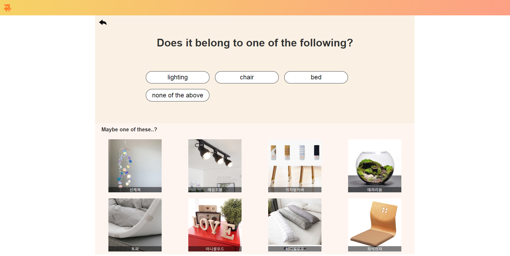

# Readme.md

Project GGYU(뀨)

This project helps people to find home styling product. If you want to find specific type of product but don't know how to call it, this will help you. We will ask some questions related with products. For example, what does it look like or ways of using it. All users have to do is just clicking answers

## **Screenshots**


Main page



Asking questions


Finding result


fail

## Library & Frameworks

Bootstrap: [http://bootstrapk.com/](http://bootstrapk.com/)

## How to use

- Go to *[wltjr1002.github.io](http://wltjr1002.github.io)*
- You can start by pressing start button at the bottom
- If you cannot understand question or don't know what the answer is, press 'not sure' or 'don't know' rather than making a random choice.
- If you have answered enough questions, we will suggest you the product. If it is what you thought, press yes. It will redirect you to market website. If it isn't, press no and keep answering.

## Files

```
├── images
│     └── ...   // logoes, background images, etc.
├── data
│     ├── product.js   // product database
│     └── questions.js // question database
├── algorithm.js       // product finding algorithm
├── question.js        // question page script
├── result.js          // result page script
├── script.js          // main script
├── style.css          
└── index.html         // main page

```

## **Contribute**

Jiseok Kim (wltjr1002@gmail.com / @wltjr1002)

Real GGYU Jin 

Jaeyoung Hwang ( akqq24@gmail.com / @Akais24)